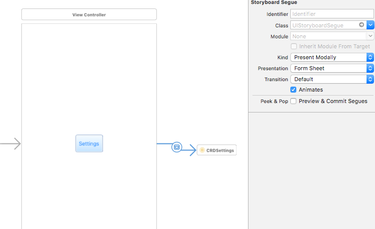
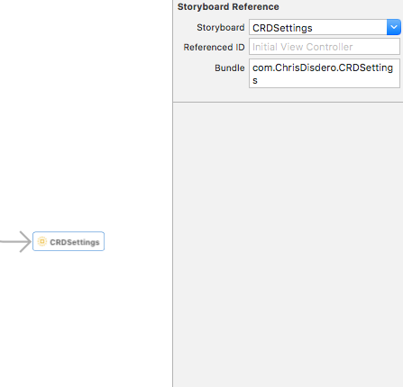

# CRDSettings
[](https://travis-ci.org/cdisdero/CRDSettings)
[](https://img.shields.io/cocoapods/v/CRDSettings.svg)
[](http://cocoadocs.org/docsets/CRDSettings)

Simple straightforward Swift-based framework for presenting and editing settings for your iOS apps

- [Overview](#overview)
- [Requirements](#requirements)
- [Installation](#installation)
- [Usage](#usage)
- [Customizing](#customizing)
- [Notifications](#notifications)
- [Reference](#reference)
- [Conclusion](#conclusion)
- [Known Issues](#knownissues)
- [License](#license)

## Overview
Often you want to allow users to set and edit app settings in both the app and in the iOS Settings app.  Exposing the app settings via a settings bundle is the right way to go because it allows your app to be compatible with MDM (mobile device management) systems that enable users to manage app settings across an enterprise, for example.  It's also a good idea to allow users to edit app settings within the app itself, but this usually entails a lot of extra coding - not only for reading and modifying settings in the app, but also presenting them in a table view and allowing them to be modified by the user.  This framework solves all of these problems.  It allows you to put all the app settings in one place - in the Settings bundle for the app.  And, with just a simple reference in your storyboard and the implementation of one protocol property, it presents the settings to the user in a table view just like the iOS Settings app does allowing full editing of each setting item.

## Requirements
- iOS 10.0+
- Xcode 9.2+
- Swift 4.2+

## Installation

### CocoaPods
Alternatively, you can install it as a Cocoapod

[CocoaPods](http://cocoapods.org) is a dependency manager for Cocoa projects. You can install it with the following command:

```bash
$ gem install cocoapods
```

> CocoaPods 1.6.0+ is required to build CRDSettings.

To integrate CRDSettings into your Xcode project using CocoaPods, specify it in your `Podfile`:

```ruby
target 'MyApp' do
  use_frameworks!

  # Pods for MyApp
  pod 'CRDSettings'
end
```

Then, run the following command:

```bash
$ pod install
```

### Carthage
You can use Carthage to add this framework to your project:

1. Add a `Cartfile` to the directory where your xcodeproj file is located.

2. Edit this file to specify the 1.0.1 release or higher of this framework:

    ```
    github "cdisdero/CRDSettings" >= 1.0.2
    ```
	
3. Run Carthage to add the framework sources and build this framework:

    ```
    carthage update
    ```
	
4. In the General tab of your Xcode project app target, drag and drop the Carthage-built framework for your target type onto the Linked Frameworks and Libraries list at the bottom.  You can find the built framework in your project folder in the subfolder Carthage/Build/[target]/CRDSettings.framework, where [target] is something like 'iOS', etc.

5. To make sure that the framework is properly stripped of extraneous CPU types for your release app, add the following Run Script build phase to your app target:

    ```
    /usr/local/bin/carthage copy-frameworks
    ```

    This assumes Carthage is installed in `/usr/local/bin` on your system.  Also specify the following Input Files in the same Run Script build phase:

    ```
    $(SRCROOT)/Carthage/Build/iOS/CRDSettings.framework
    ```

## Usage
The framework is very easy to use.  Just three steps to get it into your app:

1. In your app's storyboard, add a UI element in a view controller that you want to open a view in which to present the app settings.  For example, you might have a button in the main view controller that you want to present settings from.  In this case, create a storyboard reference to CRDSettings and set the segue to present modally with a form sheet:

    

    The reference to the CRDSettings storyboard should look like this:

    

    The reference storyboard name should be `CRDSettings` and the bundle name should be `com.ChrisDisdero.CRDSettings`.

    That takes care of adding the UI for presenting the settings in the app.

2. Implement one property of the `CRDSettingsAppProtocol` in your AppDelegate class.  Import the CRDSettings framework, and add the property:

    ```
    import CRDSettings
    
    ...
    
    @UIApplicationMain
    class AppDelegate: UIResponder, UIApplicationDelegate, CRDSettingsAppProtocol {
    
        // MARK: - CRDSettingsAppProtocol
        var settings: CRDSettings?
        
        ...
    ```

3. Finally, create an instance of CRDSettings and assign it to the settings property you just implemented.  Modify your `application:didFinishLaunchingWithOptions` method:


    ```
    ...
    
    func application(_ application: UIApplication, didFinishLaunchingWithOptions launchOptions: [UIApplicationLaunchOptionsKey: Any]?) -> Bool {
    
        // Create a new SRSettings instance for the app.
        settings = CRDSettings()
    
    ...
    ```

    In this example, we create a new instance of the CRDSettings class from the framework and assign it to the settings property we defined earlier.  For further information, take a look at how this is done in the sample CRDSettingsTestApp project target included in the framework Xcode project code.

## Customizing

You can further customize settings after creating this instance of the CRDSettings class.

One thing you may want to do that is a common need in many apps, is to add a button positioned after a switch and have the button's presence or enablement depend on the switch state.  For example:

```
func application(_ application: UIApplication, didFinishLaunchingWithOptions launchOptions: [UIApplicationLaunchOptionsKey: Any]?) -> Bool {

    // Create a new SRSettings instance for the app.
    settings = CRDSettings()

    if let settings = settings {

        // Put a button in the "MyGroup" group after the "myswitch1_preference" switch.
        if let groups = settings.groups, groups.count > 0 {
            
            if let supportGroup = settings.findGroup(title: "MyGroup1") {
                
                // Create a new button called 'My Button' and set an action for it.
                let entry = CRDSettingsActionButton(identifier: "mybutton1_preference", title: "My Button", action: { (settingEntry) in
                    
                    // Show an alert that the button was pressed.
                    let alertController = UIAlertController(title: "My Button", message:
                        "My Button was pressed.", preferredStyle: UIAlertControllerStyle.alert)
                    alertController.addAction(UIAlertAction(title: "OK", style: UIAlertActionStyle.default,handler: nil))
                    self.window?.rootViewController?.presentedViewController?.present(alertController, animated: true, completion: nil)
                })
                
                // Set this button to depend on the switch setting so that when it is off, this button is disabled.
                entry.dependsOn = "myswitch1_preference"
                entry.disableOnDepends = true
                
                // Add the button to the group.
                supportGroup.add(entry, afterIdentifier: "myswitch1_preference")
            }
        }
    }

    ...

    return true
}
```

In this example we use the `findGroup` method on the CRDSettings instance to find the setting group with the title `MyGroup1`.

Then we use the initializer for CRDSettingsActionButton to create a new action button called `My Button` with the identifier `mybutton1_preference` and an action code block that will put up an alert when we press the button.

Then we use the `dependsOn` property of the settings button we created to set a dependency on another setting with the identifer `myswitch1_preference`, which is the switch we want to use to enable/disable this button.  The property `disableOnDepends` is set to true on the button setting so that when the switch is set off, the button we created appears disabled, instead of disappearing from the list of settings.

Finally we add the button to the group we found `supportGroup` after the switch.

## Notifications
Whenever a setting value changes, either in the app or in the iOS Settings app, you want to be notified that the change occurred and what the current value of the setting is.  That can be accomplished by adding an observer for the notification name `CRDSettings.NotificationSettingsChanged`.  For example:

```
/// The list of notification observers.
private var observers: [NSObjectProtocol] = []

...

// Setup an observer for the *CRDSettings.NotificationSettingsChanged* notification so that whenever setting values change, we are notified and handed the current value.
observers.append(NotificationCenter.default.addObserver(forName: CRDSettings.NotificationSettingsChanged, object: nil, queue: OperationQueue.main) { (notification) in

    // Get the *CRDSettingsEntry* out of the notification by looking for the value with the key *CRDSettings.NotificationSettingsChangedSettingKey*
    guard let userInfo = notification.userInfo, let settingsEntry = userInfo[CRDSettings.NotificationSettingsChangedSettingKey] as? CRDSettingsEntry else { return }

    // Print out the changed settings entry to the console.
    print("Changed: \(settingsEntry)")
})
```

In the above example, an observer for the notification name `CRDSettings.NotificationSettingsChanged` is added and in that observer when it's triggered, we try to get the CRDSettingsEntry corresponding to the setting value that was changed by using the key name `CRDSettings.NotificationSettingsChangedSettingKey` and then print out the setting value to the console.

You might use these notifications to monitor certain setting values and change your app behavior and/or update view controls in a view controller whenever you get the `CRDSettings.NotificationSettingsChanged` notification.

If your app is in the background and a change is made to your app settings in the iOS Settings app, when you activate your app, this notification will fire and you can then update UI elements and handle behavioral changes in your app.

## Reference

### CRDSettings

#### Overview
This class represents the collection of the app's settings as read and synchronized with the settings bundle.

#### Notifications

* `CRDSettings.NotificationSettingsChanged`

    Name of the notification that gets posted whenever a setting value changes.
    
* `CRDSettings.NotificationSettingsChangedSettingKey`

    Name of the key that holds the `CRDSettingsEntry` object representing the setting value that changed in the notification `CRDSettings.NotificationSettingsChanged`

#### Initializer

* `CRDSettings(_ settingsBundleName: String? = nil)`

	Instantiates a new CRDSettings object with the given settings bundle name, which by default is "Settings" if nil is specified.

#### Public properties
* `groups: [CRDSettingsGroup]? { get }`

	Returns the collection of groups (if any) in the settings.

#### Public methods
* `findGroup(title: String) -> CRDSettingsGroup?`
    
	Returns a CRDSettingsGroup object representing the first group found matching the group title specified, or nil if none found.

* `findSetting(identifier: String) -> CRDSettingsEntry?`

	Returns a CRDSettingsEntry object representing the first setting found matching the identifier specified across all groups, or nil if none found.

### CRDSettingsGroup

#### Overview
This class represents an entry in the settings bundle that is of type PSGroupSpecifier.

#### Public properties

* `title: String { get }`

	The title of the group.

* `entries: [CRDSettingsEntry]? { get }`

	The collection of CRDSettingsEntry objects within this group, if any.

#### Public methods

* `add(_ entry: CRDSettingsEntry, afterIdentifier: String? = default)`

Adds the specified CRDSettingsEntry to this group after the entry with the identifer specified, if specified and if found, or to the end of the group, otherwise.

* `insert(_ entry: CRDSettingsEntry, atIndex: Int)`

Inserts the specified CRDSettingsEntry to this group at the index specified.

* `find(_ identifier: String) -> CRDSettingsEntry?`

Returns the first CRDSettingsEntry matching the identifer specified, or nil if not found.

### CRDSettingsToggleSwitch

#### Overview

This class represents a settings entry of type PSToggleSwitchSpecifier in the app settings bundle.

#### Public properties
* `identifier: String { get }`

	The identifier of the setting entry.

* `title: String { get }`

	The title of the setting entry.

* `currentValue: Any? { get set }`

	The current value for the setting entry, if any.  In the case of the switch it is a `Bool`, either `true` or `false` depending on the switch state.

* `dependsOn: String? { get set }`
	
	The identifier of another CRDSettingsEntry that this entry depends on. If the current value of that entry changes to false, this entry will either be disabled or hidden depending on the value of this setting entry’s property `disableOnDepends`.

* `disableOnDepends: Bool { get set }`

	Flag to control whether this setting entry is disabled (true) or hidden (false) when another setting entry it depends on (see  `dependsOn`) is false.

* `enabled: Bool { get set }`
	
	Flag to indicate whether this setting entry is enabled for user interaction.

### CRDSettingsSlider

#### Overview

This class represents PSSliderSpecifier type entries in the app settings bundle.

#### Public properties

* `identifier: String { get }`

	The identifier of the setting entry.

* `currentValue: Any? { get set }`

	The current value for the setting entry, if any.  In the case of the slider it is a `Float`.

* `dependsOn: String? { get set }`

	The identifier of another CRDSettingsEntry that this entry depends on. If the current value of that entry changes to false, this entry will either be disabled or hidden depending on the value of this setting entry’s property `disableOnDepends`.

* `disableOnDepends: Bool { get set }`

	Flag to control whether this setting entry is disabled (true) or hidden (false) when another setting entry it depends on (see  `dependsOn`) is false.

* `enabled: Bool { get set }`

	Flag to indicate whether this setting entry is enabled for user interaction.

* `minValue: Float? { get }`

	The minimum value for this setting entry, if any.

* `minValueImage: String? { get }`

	The file name (without extension) of an image stored in the app’s setting bundle to use for the minimum value on the slider, if any.

* `maxValue: Float? { get }`

	The maximum value for this setting entry, if any.

* `maxValueImage: String? { get }`

	The file name (without extension) of an image stored in the app’s setting bundle to use for the maximum value on the slider, if any.

* `incrementValue: Float? { get set }`

	The increment value for this setting entry, if any.

### CRDSettingsMultiValue

#### Overview

This class represents PSMultiValueSpecifier type entries in the app settings bundle.

#### Public properties

* `identifier: String { get }`

	The identifier of the setting entry.

* `title: String { get }`

	The title of the setting entry.

* `currentValue: Any? { get set }`

	The current value for the setting entry, if any.  In the case of the multi-value entry it is either a `String` or a `NSNumber` depending on the type of the `values` array property.

* `dependsOn: String? { get set }`

	The identifier of another CRDSettingsEntry that this entry depends on. If the current value of that entry changes to false, this entry will either be disabled or hidden depending on the value of this setting entry’s property `disableOnDepends`.

* `disableOnDepends: Bool { get set }`

	Flag to control whether this setting entry is disabled (true) or hidden (false) when another setting entry it depends on (see  `dependsOn`) is false.

* `enabled: Bool { get set }`

	Flag to indicate whether this setting entry is enabled for user interaction.

* `titles: [String]? { get }`

	The list of titles for the setting entry.

* `selectedTitle: String? { get }`

	The currently selected title from the array of `titles`.

* `values: [Any]? { get }`

	The list of values associated with the `titles` for the setting entry.

### CRDSettingsTextField

#### Overview

This class represents PSTextFieldSpecifier type entries in the app settings bundle.

#### Public properties

* `identifier: String { get }`

	The identifier of the setting entry.

* `title: String { get }`

	The title of the setting entry.

* `currentValue: Any? { get set }`

	The current value for the setting entry, if any.  In the case of the text field it is a `String` representing the currently entered text.

* `dependsOn: String? { get set }`

	The identifier of another CRDSettingsEntry that this entry depends on. If the current value of that entry changes to false, this entry will either be disabled or hidden depending on the value of this setting entry’s property `disableOnDepends`.

* `disableOnDepends: Bool { get set }`

	Flag to control whether this setting entry is disabled (true) or hidden (false) when another setting entry it depends on (see  `dependsOn`) is false.

* `enabled: Bool { get set }`

	Flag to indicate whether this setting entry is enabled for user interaction.

* `isSecure: Bool { get }`

	A flag indicating whether the field is secure (like a password).

* `keyboardType: CRDSettingsTextFieldKeyboardType { get }`

	The type of soft keyboard to display when editing this field. This can be one of these enum values: `Alphabet`, `NumbersAndPunctuation`, `NumberPad`, `URL`, or `EmailAddress`.  These enum values have the same meaning as those from UIKeyboardType.

* `autoCapitalizationType: CRDSettingsTextFieldAutoCapitalizationType { get }`

	The type of auto-capitalization for this field.  This can be one of these enum values: `None`, `Words`, `Sentences`, or `AllCharacters`.  These enum values have the same meanings as those from UITextAutocapitalizationType.

* `autoCorrectionType: CRDSettingsTextFieldAutoCorrectionType { get }`

	The type of auto-correction for this field.  This can be one of these enum values: `Default`, `No`, or `Yes`.  These enum values have the same meaning as those from UITextAutocorrectionType.

### CRDSettingsTitle

#### Overview

This class represents a settings entry of type PSTitleValueSpecifier in the app settings bundle.

#### Public properties

* `identifier: String { get }`

	The identifier of the setting entry.

* `title: String { get }`

	The title of the setting entry.

* `currentValue: Any? { get set }`

	The current value for the setting entry, if any.  In the case of the title entry it is a `String` representing the current title (equivalent to `title`).

* `dependsOn: String? { get set }`

	The identifier of another CRDSettingsEntry that this entry depends on. If the current value of that entry changes to false, this entry will either be disabled or hidden depending on the value of this setting entry’s property `disableOnDepends`.

* `disableOnDepends: Bool { get set }`

	Flag to control whether this setting entry is disabled (true) or hidden (false) when another setting entry it depends on (see  `dependsOn`) is false.

* `enabled: Bool { get set }`

	Flag to indicate whether this setting entry is enabled for user interaction.

### CRDSettingsActionButton

#### Overview

This class represents a settings entry of type `button` in the app settings bundle.  NOTE: This setting entry is not natively supported by the settings bundle Root.plist.

#### Initializer

* `CRDSettingsActionButton(identifier: String, title: String, action: CRDSettingsAction? = default) throws`

	Instantiates a new CRDSettingsActionButton object with the given identifier, title, and optional action.  CRDSettingsAction is a typealias for a function of type `(_ settingEntry: CRDSettingsEntry?) -> Void`.  So when the action code is executed when the button is pressed, the CRDSettingsActionButton setting entry instance for the button is passed in to the action code block.

#### Public properties

* `identifier: String { get }`

	The identifier of the setting entry.

* `title: String { get }`

	The title of the setting entry which appears in the caption of the button.

* `dependsOn: String? { get set }`

	The identifier of another CRDSettingsEntry that this entry depends on. If the current value of that entry changes to false, this entry will either be disabled or hidden depending on the value of this setting entry’s property `disableOnDepends`.

* `disableOnDepends: Bool { get set }`

	Flag to control whether this setting entry is disabled (true) or hidden (false) when another setting entry it depends on (see  `dependsOn`) is false.

* `enabled: Bool { get set }`

	Flag to indicate whether this setting entry is enabled for user interaction.

* `action: CRDSettingsAction? { get }`

	The CRDSettingsAction block of code to execute for this setting entry when the button is pressed, if any.

## Conclusion
I hope this framework is helpful to you in your next Swift project.  I'll be updating as time and inclination permits and of course I welcome all your feedback.

## Known Issues
* The framework does not support the TrueValue and FalseValue for a [PSToggleSwitchSpecifier](https://developer.apple.com/library/content/documentation/PreferenceSettings/Conceptual/SettingsApplicationSchemaReference/Articles/PSToggleSwitchSpecifier.html#//apple_ref/doc/uid/TP40007012-SW1) settings entry in the CRDSettingsToggleSwitch class.  This is because there is an open [radar](http://www.openradar.me/26541820) (bug) filed against it as of 30-May-2016.  Whenever this issue is fixed, I'll try to add support for it.

* [PSChildPaneSpecifier](https://developer.apple.com/library/content/documentation/PreferenceSettings/Conceptual/SettingsApplicationSchemaReference/Articles/PSChildPaneSpecifier.html#//apple_ref/doc/uid/TP40007017-SW1) types of settings entries are not currently supported by the framework.

* [PSRadioGroupSpecifier](https://developer.apple.com/library/content/documentation/PreferenceSettings/Conceptual/SettingsApplicationSchemaReference/Articles/RadioGroupElement.html#//apple_ref/doc/uid/TP30915196-SW2) types of settings entries are not currently supported by the framework.

* The key SupportedUserInterfaceIdioms that is part of the [schema](https://developer.apple.com/library/content/documentation/PreferenceSettings/Conceptual/SettingsApplicationSchemaReference/Introduction/Introduction.html#//apple_ref/doc/uid/TP40007005-SW1) for many settings entries is not currently supported by the framework.

* The [PSGroupSpecifier](https://developer.apple.com/library/content/documentation/PreferenceSettings/Conceptual/SettingsApplicationSchemaReference/Articles/PSGroupSpecifier.html#//apple_ref/doc/uid/TP40007009-SW1) key FooterText is not currently supported by the framework.

* The following keys for [PSMultiValueSpecifier](https://developer.apple.com/library/content/documentation/PreferenceSettings/Conceptual/SettingsApplicationSchemaReference/Articles/PSMultiValueSpecifier.html#//apple_ref/doc/uid/TP40007016-SW1) are not currently supported by the framework: ShortTitles, and DisplaySortedByTitle. 

* The image files used for the `MinimumValueImage` and `MaximumValueImage` for a [PSSliderSpecifier](https://developer.apple.com/library/archive/documentation/PreferenceSettings/Conceptual/SettingsApplicationSchemaReference/Articles/PSSliderSpecifier.html#//apple_ref/doc/uid/TP40007013-SW1) must be added directly to the Settings.bundle within the project folder in order for these images to appear in the iOS Settings app as well as in the CRDSettings table view.  These images wont be shown in the iOS Settings app if they are in the Assets.xcassets of the project, unfortunately.  I think this may be a limitation of the underlying Apple framework for this control type and/or the iOS Settings app.

## License
CRDSettings is released under an Apache 2.0 license. See LICENSE for details.
